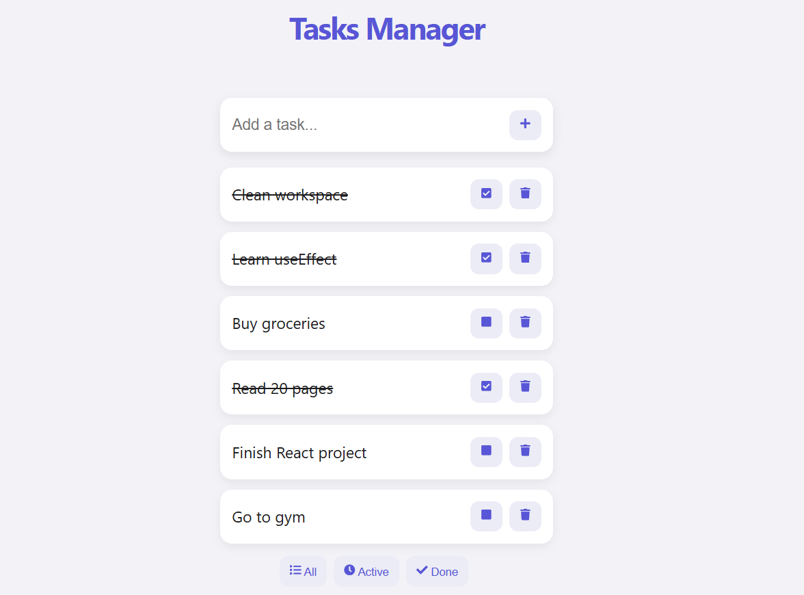
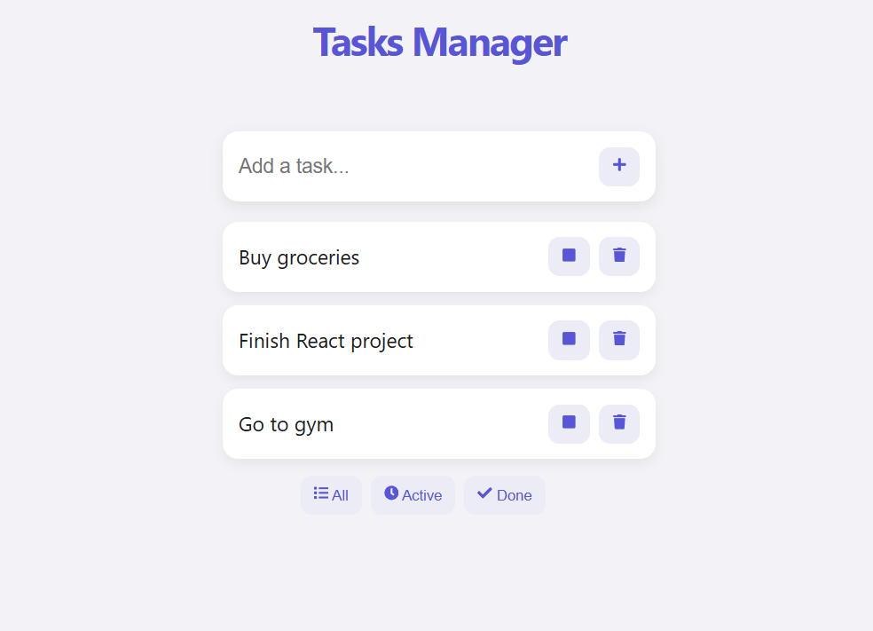
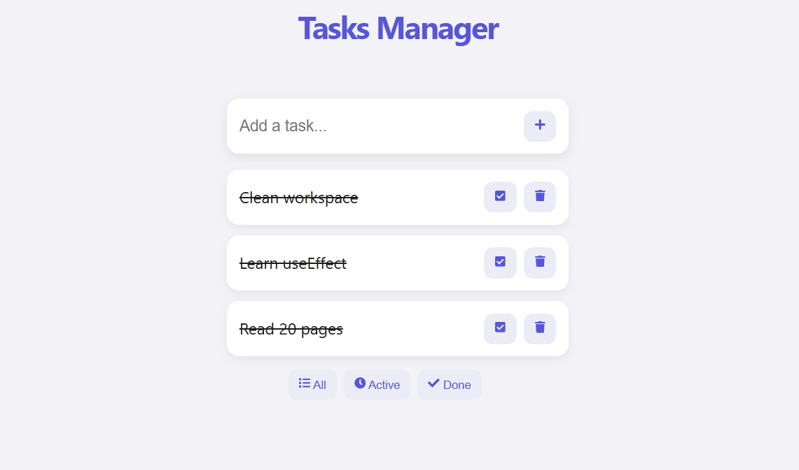

# Task Manager App (React)

Modern Todo application built with React, built as a rewrite of my Vanilla JS TasksFlow project.

---

## App Preview

### Main view with tasks



User can add tasks, mark them as completed, delete them, and filter between different views.

- Tasks displayed in a clean list
- Completed tasks are visually marked
- Real-time UI updates using React state

---

### Filtered view (Active)



### Filtered view (Done)



Tasks can be filtered to show:
- All tasks
- Active tasks
- Completed tasks

UI updates instantly based on selected filter.

---

## Features

* Add new tasks
* Delete tasks with animation
* Mark tasks as completed
* Filter tasks (All / Active / Done)
* Persistent storage using localStorage
* State management with React hooks
* Data persists after page refresh
* Clean and minimal UI

---

## Technologies Used

* React
* JavaScript (ES6+)
* CSS
* Vite

---

## How to Run

Install dependencies and start development server:
```bash
npm install
npm run dev
```

## Project Notes

This project is a React refactor of my original Vanilla JS TasksFlow app.
The main improvement is replacing DOM manipulation with React state management (useState, useEffect) and cleaner UI rendering logic.

## Author
Made by Milos Ignjatovic